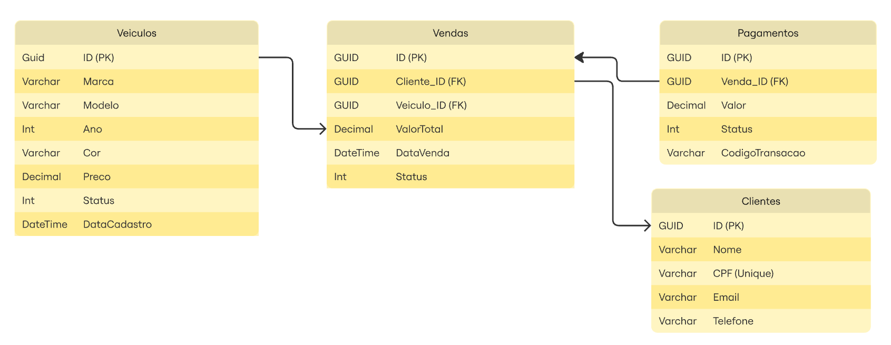

# 🚗 VeiculeSale API

[](https://dotnet.microsoft.com/download/dotnet/8.0)
[](https://www.docker.com/)
[](https://kubernetes.io/)
[](LICENSE)

API desenvolvida como parte da avaliação da Fase 2 do **Tech Challenge (Pós-Tech)**. O sistema gerencia o ciclo de vida de venda de veículos, desde o cadastro, controle de estoque, até a efetivação da venda via processamento de pagamentos.

---

## 📋 Índice
- [Sobre o Projeto](#-sobre-o-projeto)
- [Arquitetura](#-arquitetura)
- [Tecnologias](#-tecnologias)
- [Pré-requisitos](#-pré-requisitos)
- [Como Rodar](#-como-rodar)
  - [Opção 1: Docker Compose](#opção-1-docker-compose-mais-simples)
  - [Opção 2: Kubernetes (Minikube)](#opção-2-kubernetes-minikube-produção)
- [Documentação (Swagger)](#-documentação-swagger)
- [Health Checks](#-health-checks)

---

## 📖 Sobre o Projeto

O **VeiculeSale** é uma API RESTful robusta projetada para alta escalabilidade. Ela permite:
* Cadastro e gestão de veículos.
* Gestão de clientes.
* Registro de vendas (com validação de disponibilidade).
* Integração com Webhooks de pagamento (Simulação de Gateway).
* Histórico de veículos vendidos.

---

## 🏗 Arquitetura

O projeto segue os princípios da **Clean Architecture** e **DDD (Domain-Driven Design)**, garantindo desacoplamento e testabilidade.

### Padrões Utilizados:
* **CQRS (Command Query Responsibility Segregation):** Separação clara entre operações de leitura e escrita usando **MediatR**.
* **Repository Pattern:** Abstração da camada de dados.
* **Unit of Work:** Gestão transacional.
* **Result Pattern:** Tratamento de erros de domínio sem exceções desnecessárias.



---

## 🚀 Tecnologias

* **.NET 8** (C#)
* **Entity Framework Core** (ORM)
* **PostgreSQL** (Banco de Dados)
* **Docker & Docker Compose** (Containerização)
* **Kubernetes** (Orquestração)
* **MediatR** (Mensageria in-process)
* **Swagger/OpenAPI** (Documentação)
* **XUnit & Moq** (Testes Unitários)

---

## ⚙️ Pré-requisitos

* [Docker Desktop](https://www.docker.com/products/docker-desktop) instalado.
* [Minikube](https://minikube.sigs.k8s.io/docs/start/) (para rodar via Kubernetes).
* [.NET 8 SDK](https://dotnet.microsoft.com/download) (apenas para desenvolvimento/testes locais).

---

## 🏃 Como Rodar

### Opção 1: Docker Compose (Mais Simples)
Ideal para testar a integração rapidamente sem subir o cluster Kubernetes.

```bash
# Na raiz do projeto
docker-compose up --build