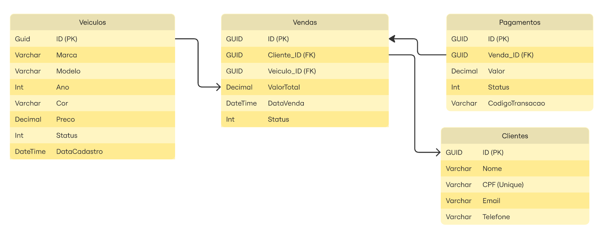
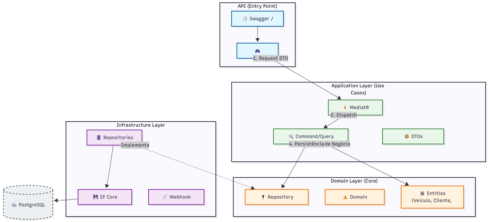
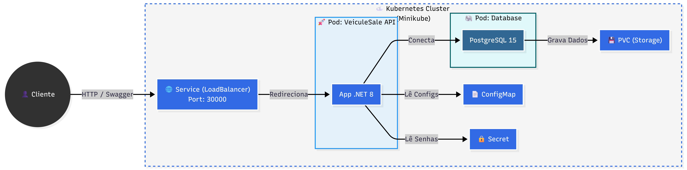

# 🚗 VeiculeSale API


> API robusta para gestão de vendas de veículos, implementada com **Clean Architecture**, **DDD** e **CQRS**.

---

## 📑 Índice
- [📍 Visão Geral](#-visão-geral)
- [🏗 Arquitetura e Design](#-arquitetura-e-design)
- [🛠 Tecnologias](#-tecnologias)
- [🚀 Como Rodar (Kubernetes)](#-como-rodar-kubernetes--minikube)
- [⚡ Guia de Teste (Cenário do Vídeo)](#-guia-de-teste-cenário-do-vídeo)
- [💓 Monitoramento](#-monitoramento)

---

## 📍 Visão Geral
O **VeiculeSale** gerencia todo o ciclo de vida de uma concessionária digital. O sistema garante a integridade das transações, impedindo vendas de veículos indisponíveis e orquestrando pagamentos via Webhook.

**Principais Funcionalidades:**
* ✅ Cadastro e Edição de Veículos.
* ✅ Listagem ordenada por preço (Requisito de Negócio).
* ✅ Processamento de Venda (Lock otimista de estoque).
* ✅ Integração Assíncrona de Pagamentos (Webhook).

---

## 🏗 Arquitetura e Design

O projeto foi desenhado para ser desacoplado e testável, seguindo rigorosamente os princípios SOLID.

| Camada | Responsabilidade |
| :--- | :--- |
| **API** | Entry point, Controllers, Swagger e HealthChecks. |
| **Application** | Casos de uso (Handlers), CQRS, DTOs e Interfaces. |
| **Domain** | Entidades, Value Objects, Enums e Regras de Negócio "Core". |
| **Infrastructure** | Implementação de Repositórios (EF Core), Mapeamentos e configs de Banco. |







---

## 🛠 Tecnologias

* **.NET 8**
* **Entity Framework Core** (Code First)
* **PostgreSQL**
* **MediatR** (Padrão Mediator)
* **Docker & Kubernetes** (Infraestrutura)
* **Swagger/OpenAPI** (Documentação)
* **XUnit** (Testes de Unidade)

---

## 🚀 Como Rodar (Kubernetes / Minikube)

Siga os passos abaixo para subir a infraestrutura completa, baixando a imagem diretamente do Docker Hub.

### 1. Iniciar o Cluster
```bash
minikube start
```

### 2. Aplicar Manifestos
Execute na ordem para garantir as dependências:

```bash
# 1. Configurações (ConfigMap e Secrets)
kubectl apply -f k8s/configmap.yaml
kubectl apply -f k8s/secrets.yaml

# 2. Banco de Dados e Volume
kubectl apply -f k8s/postgres.yaml

# 3. Aplicação API (Baixa a imagem do Docker Hub)
kubectl apply -f k8s/api.yaml
```

### 3. Acessar a Aplicação
Para acessar a API localmente, utilize o port-forward para redirecionar o tráfego do cluster para sua máquina:

```bash
kubectl port-forward svc/veiculesale-service 8080:80
```

📍 **Swagger Disponível em:** [http://localhost:8080/swagger](http://localhost:8080/swagger)

---

## ⚡ Guia de Teste (Cenário do Vídeo)

Abaixo estão os comandos `cURL` utilizados na demonstração do vídeo.
*Requisito: Mantenha o terminal com o `port-forward` aberto e rode estes comandos em outro terminal.*

### Passo 1: Cadastrar Veículos (Teste de Ordenação)
Cadastramos 3 veículos com preços variados para validar a listagem ordenada.

**1. Honda Civic (Caro - R$ 150k)**
```bash
curl -X 'POST' \
  'http://localhost:8080/api/veiculos' \
  -H 'Content-Type: application/json' \
  -d '{
  "marca": "Honda",
  "modelo": "Civic Touring",
  "ano": 2024,
  "cor": "Cinza Basalto",
  "preco": 150000.00
}'
```

**2. Fiat Uno (Barato - R$ 25k)**
```bash
curl -X 'POST' \
  'http://localhost:8080/api/veiculos' \
  -H 'Content-Type: application/json' \
  -d '{
  "marca": "Fiat",
  "modelo": "Uno Mille",
  "ano": 2010,
  "cor": "Branco",
  "preco": 25000.00
}'
```

**3. Fiat Argo (Médio - R$ 60k)**
```bash
curl -X 'POST' \
  'http://localhost:8080/api/veiculos' \
  -H 'Content-Type: application/json' \
  -d '{
  "marca": "Fiat",
  "modelo": "Argo",
  "ano": 2020,
  "cor": "Vermelho",
  "preco": 60000.00
}'
```

> 🔍 **Validação:** Ao chamar o `GET /api/veiculos/disponiveis`, a ordem retornada deve ser: **Uno (25k) -> Argo (60k) -> Civic (150k)**.

---

### Passo 2: Editar Veículo (PUT)
Alteração do Fiat Argo para "Argo New" com reajuste de preço.

```bash
curl -X 'PUT' \
  'http://localhost:8080/api/veiculos/{ID_DO_ARGO}' \
  -H 'Content-Type: application/json' \
  -d '{
  "id": "{ID_DO_ARGO}",
  "marca": "Fiat",
  "modelo": "Argo New",
  "ano": 2020,
  "cor": "Preto",
  "preco": 65000.00
}'
```

---

### Passo 3: Fluxo de Venda

**1. Cadastrar Cliente**
```bash
curl -X 'POST' \
  'http://localhost:8080/api/clientes' \
  -H 'Content-Type: application/json' \
  -d '{
  "nome": "Rafael Avaliador",
  "cpf": "627.969.560-32",
  "email": "rafael@email.com",
  "telefone": "11999999999"
}'
```

**2. Realizar Venda (Status: Aguardando Pagamento)**
```bash
curl -X 'POST' \
  'http://localhost:8080/api/vendas' \
  -H 'Content-Type: application/json' \
  -d '{
  "veiculoId": "{ID_DO_VEICULO_DESEJADO}",
  "clienteId": "{ID_DO_CLIENTE_RAFAEL}" 
}'
```
> 📝 **Nota:** Copie o `codigoTransacao` retornado para usar no webhook.

**3. Aprovar Pagamento (Webhook)**
```bash
curl -X 'POST' \
  'http://localhost:8080/api/pagamentos/webhook' \
  -H 'Content-Type: application/json' \
  -d '{
  "codigoTransacao": "{CODIGO_DA_TRANSACAO}",
  "novoStatus": "Aprovado" 
}'
```

> 🔍 **Validação:** Ao chamar o `GET /api/veiculos/vendidos`, os veículos `Vendidos` serão listados.

✅ **Resultado Final:** O veículo passa para o status `Vendido`, o estoque é baixado e a venda é concluída.

---

## 💓 Monitoramento

| Endpoint | Descrição |
| :--- | :--- |
| `GET /health` | Retorna **200 OK** ("Healthy") se a API e Banco estiverem conectados. |

---
**Desenvolvido para o Tech Challenge - Fase 2**
